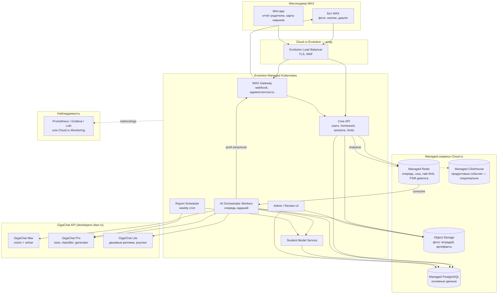

# Архитектура MVP «AI-проверка домашней работы в MAX»

Инфраструктура: **Cloud.ru Evolution** (облако Сбера). LLM/vision: **GigaChat API**.
Целевая нагрузка: **1000+ DAU × 25+ обращений** = 25 000+ пользовательских действий в день.

---

## 1. Что считаем нагрузкой

### 1.1. Пользовательские обращения (конкурсная метрика)

Одно обращение = действие, инициированное пользователем в MAX: фото, нажатие кнопки, ответ в диалоге, запрос подсказки, ответ на проверочную задачу, открытие отчёта родителем.

| Параметр | Значение |
|---|---|
| DAU | 1 000 (проектируем с запасом до 3 000) |
| Обращений на DAU | 25 |
| Обращений в сутки | 25 000 (запас до 75 000) |
| Пиковое окно | 16:00–21:00 мск, ~60 % дневного трафика |
| Средний RPS в пике | ~1 rps |
| Пиковый RPS (×5 burst) | ~5 rps, проектируем на 15 rps |

Вывод: по HTTP-нагрузке это очень маленькая система. Узкое место — **не API, а LLM-пайплайн**: латентность GigaChat, лимиты API и стоимость токенов.

### 1.2. LLM-вызовы (внутренняя метрика, не считается обращением)

Одна домашняя работа (≈7 заданий) порождает примерно:

| Этап | Вызовов | Модель | ~Токенов на вызов |
|---|---|---|---|
| Vision: сегментация + распознавание | 1–2 | GigaChat Max (vision) | 3 000–5 000 |
| Solver: независимое решение | 7 (по заданию) | GigaChat Max / Pro | 800–1 500 |
| Validator | 0 (детерминированный, SymPy) | — | — |
| Error Classifier | 1–3 (только для ошибок) | GigaChat Pro | 1 000 |
| Tutor: диалог | 8–12 | GigaChat Pro (Lite для простых реплик) | 1 500–2 500 |
| Exercise Generator | 1–3 | GigaChat Pro | 800 |
| Parent Report | 1/неделя/ученик | GigaChat Pro | 2 000 |

Итого ≈ **20–30 LLM-вызовов и 40–60 тыс. токенов на одну домашнюю работу**.
При 1 000 работ в день: **25–30 тыс. вызовов, 40–60 млн токенов в сутки**. Это главная статья затрат и главный объект оптимизации (кэш, роутинг по моделям, детерминированная валидация вместо повторных вызовов).

---

## 2. Общая схема



Принцип: **тонкий синхронный слой + асинхронный AI-пайплайн**. Webhook от MAX отвечает за миллисекунды, тяжёлая работа уходит в очередь, результат пушится обратно в чат.

---

## 3. Компоненты

### 3.1. MAX Gateway
- Принимает webhook MAX Bot API, проверяет подпись, дедуплицирует по `update_id` (Redis, TTL 24 ч).
- Мгновенно отвечает MAX 200 OK; сообщение кладёт в очередь `inbound`.
- Единственный компонент, знающий о формате MAX. Всё, что уходит в чат, идёт через него (`send_message`, `send_photo`, кнопки).
- Фото: скачивает файл из MAX → кладёт в Object Storage → передаёт в API только `s3_key`.

### 3.2. Core API (FastAPI / Go)
- Пользователи, роли, связка родитель–ребёнок (код-приглашение, deep link).
- Homework / Exercise / TutoringSession CRUD.
- **Лимиты и антифрод**: N домашних работ в день на ученика, N подсказок на задание, rate-limit на пользователя (Redis token bucket).
- **Конечный автомат диалога** (FSM) в Redis: `awaiting_photo → recognizing → review → tutoring(exercise_id, hint_level) → drill → done`. Детерминированный, LLM его не контролирует.
- Учёт продуктовых событий (`homework_uploaded`, `hint_requested`, `error_fixed`, …) → таблица `events` в PostgreSQL, позже в ClickHouse.

### 3.3. AI Orchestrator (worker pool)
Python-воркеры (например `arq`/`Celery` поверх Managed Redis; Managed Kafka — не нужен на MVP). Пайплайн разбит на независимые шаги-функции с единым контрактом `(input: dict) -> dict (JSON Schema)`, чтобы менять модель/провайдера/промпт без переписывания.

| Шаг | Что делает | Модель GigaChat | Fail-safe |
|---|---|---|---|
| **Vision / Parser** | Сегментирует фото на задания, распознаёт условие и рукописное решение, возвращает JSON с `confidence` по каждому заданию | Max (vision через `/files` + attachments) | `confidence < 0.7` → «переснять» / «подтверди, что здесь написано …» |
| **Solver** | Независимо решает задание, возвращает структурированные шаги и ответ | Max (математика), Pro для простых типов | Self-consistency: 2 решения при расхождении |
| **Validator** | Пересчитывает арифметику из шагов ученика и модели через SymPy; проверяет единицы, знаки | без LLM | Если Validator и Solver расходятся → эскалация в admin-review, ребёнку — мягкий ответ |
| **Comparator + Error Classifier** | Находит шаг расхождения, классифицирует по таксономии (`calc_error`, `strategy_error`, `condition_misread`, `slip`, …) | Pro, JSON-режим | `confidence < 0.6` → error_type = `unclear`, тьютор задаёт уточняющий вопрос |
| **Tutor** | Ведёт диалог по tutoring policy (уровни подсказок 0→3), не выдаёт ответ до уровня 3 | Pro; Lite для коротких «да/нет»-реплик | Жёсткие правила в коде: ответ вставляется в промпт только на уровне 3 |
| **Exercise Generator** | Генерирует похожую задачу + эталон, эталон проверяется Validator'ом | Pro | Задача без валидного эталона отбрасывается, берётся из пула |
| **Parent Report** | По структурированной истории (не по фото) пишет краткий отчёт | Pro | Шаблон-фолбэк из статистики без LLM |

### 3.4. Student Model Service
Детерминированный, без LLM в критическом пути.
- Таблица `skill_state`: `(student_id, topic, skill) → success_rate, attempts, last_seen, streak, decay`.
- Апдейт по правилам: экспоненциальное сглаживание успешности, счётчик повторов `error_type` за 14 дней, «навык сформирован» при ≥ N успехов подряд.
- Выдаёт: `weak_skills`, `repeated_errors`, `next_drill_skill`. LLM используется только для формулировки текста поверх этих данных.
- Позже заменяется на BKT/Bayesian без смены контракта.

### 3.5. Report Scheduler
CronJob в Kubernetes (воскресенье 18:00) → для каждого активного ученика собирает статистику → Parent Report → пуш родителю через MAX Gateway.

### 3.6. Admin / Review UI
Простая внутренняя панель: очередь спорных проверок (расхождение Solver/Validator, низкая confidence), просмотр фото + распознанного JSON, ручная разметка → датасет для оценки качества. На MVP — Streamlit/React за basic-auth, доступ только команде.

---

## 4. Интеграция с GigaChat API

- **Авторизация**: OAuth `client_id/secret` → access token на 30 минут. Токен кэшируется в Redis, обновляется одним воркером (lock), остальные читают.
- **Сертификат**: для подключения к `gigachat.devices.sberbank.ru` нужен корневой сертификат Минцифры в trust store образов.
- **Изображения**: загрузка через `POST /files` → `file_id` → передача в `attachments` сообщения. Хранить `file_id` не нужно, фото живёт в Object Storage.
- **Структурированный вывод**: все внутренние шаги требуют JSON по схеме; ответ валидируется `pydantic`, при ошибке — один retry с указанием на невалидность, затем fallback.
- **Function calling** (Max): Solver может вызывать функцию `calc(expression)` — выполняется на нашей стороне через SymPy, что снижает арифметические галлюцинации.
- **Роутинг по моделям**: Max только там, где нужен vision или сложная математика; тьютор — Pro; служебные короткие реплики — Lite. Это ~2–3× экономии токенов.
- **Кэш**: hash(изображение задания + условие) → результат Solver в Redis на 30 дней. Домашние задания из учебников повторяются у разных детей — hit rate будет заметный.
- **Лимиты**: клиент с backoff, circuit breaker; при недоступности GigaChat — ребёнку «проверяю, вернусь через пару минут», задача остаётся в очереди с ретраями.
- **Абстракция провайдера**: интерфейс `LLMClient` / `VisionClient`; GigaChat — реализация №1. Позволяет подключить другую модель для A/B-сравнения качества распознавания (открытый вопрос №3–4 из ТЗ).
- **Промпты** — в репозитории как версионированные файлы (`prompts/tutor/v3.md`), версия промпта пишется в каждую запись `ErrorAnalysis`/`TutoringSession` для последующего анализа качества.

Актуальный список моделей (линейки GigaChat 2 / 3, наличие vision у Pro/Max, лимиты RPS на тарифе) нужно свериться с документацией на момент старта — линейка обновляется несколько раз в год.

---

## 5. Инфраструктура на Cloud.ru Evolution

| Слой | Сервис Cloud.ru | Конфигурация MVP (1 000 DAU) | Запас до 3 000 DAU |
|---|---|---|---|
| Вход | Evolution Load Balancer | 1 LB, TLS | без изменений |
| Compute | Evolution Managed Kubernetes | 3 ноды × 4 vCPU / 8 GB | node autoscaling до 6 |
| Gateway | Deployment | 2 реплики | HPA 2–4 |
| Core API | Deployment | 2 реплики | HPA 2–6 |
| AI Workers | Deployment | 4 реплики × concurrency 10 (IO-bound) | HPA по длине очереди (KEDA) до 12 |
| Student Model | Deployment | 1–2 реплики | 2 |
| Report | CronJob | — | — |
| Admin UI | Deployment | 1 реплика | 1 |
| БД | Evolution Managed PostgreSQL | 2 vCPU / 8 GB, master + replica, PITR-бэкапы | вертикально до 4–8 vCPU |
| Очередь / кэш | Evolution Managed Redis | Master/Replica, 4 GB | Cluster |
| Файлы | Evolution Object Storage | bucket `homework-images`, lifecycle: удаление через 90 дней (или по запросу) | — |
| Аналитика | PostgreSQL `events` → позже Evolution Managed ClickHouse | — | ClickHouse при > 5 млн событий |
| Образы | Evolution Artifact Registry | — | — |
| Секреты | Kubernetes Secrets (GigaChat credentials, MAX token) | — | External Secrets при росте |
| Мониторинг | Prometheus + Grafana + Loki в кластере (или Cloud.ru Monitoring/Logging) | — | — |
| Сеть | VPC, БД и Redis без публичных IP, egress только к GigaChat и MAX API | — | — |

**Альтернатива на первые 2–4 недели** (10–20 семей пилота): вместо Kubernetes — **Evolution Container Apps** для Gateway/API/Workers. Дешевле и проще, но с тем же контейнерным образом; переезд в Managed Kubernetes — это смена манифестов, не кода.

Оценка стоимости инфраструктуры на 1 000 DAU — порядка 40–70 тыс. ₽/мес; токены GigaChat при 40–60 млн токенов/день будут существенно больше и зависят от тарифа. Точные цифры — по калькуляторам Cloud.ru и тарифам GigaChat на момент запуска.

---

## 6. Данные

### 6.1. PostgreSQL (основные сущности из ТЗ, уточнённые)

```
users(id, role, max_user_id, consent_at, created_at)
student_profiles(id, user_id, grade, program, parent_user_id, daily_limit)
homeworks(id, student_id, subject, status, image_key, vision_confidence, created_at)
exercises(id, homework_id, number, task_text, student_solution_json, ref_solution_json,
          verdict, confidence, solver_model, prompt_version)
error_analyses(id, exercise_id, topic, skill, error_type, confidence, explanation, prompt_version)
tutoring_sessions(id, exercise_id, state, hint_level, messages_jsonb, resolved, created_at)
drills(id, session_id, task_text, ref_answer, student_answer, correct)
skill_states(student_id, subject, topic, skill, success_rate, attempts, last_seen, streak)
parent_reports(id, student_id, period_start, period_end, summary, recommendations, created_at)
events(id, user_id, type, payload_jsonb, ts)            -- продуктовая аналитика
review_queue(id, exercise_id, reason, resolved_by, resolution, created_at)
prompt_cache(hash, step, result_jsonb, created_at)      -- можно вынести в Redis
```

### 6.2. Redis
- `queue:ai:*` — задания пайплайна (приоритет: диалог тьютора > проверка фото > отчёты).
- `fsm:{user_id}` — состояние диалога, TTL 24 ч.
- `ratelimit:{user_id}`, `dedup:update:{id}`, `gigachat:token`.
- `cache:solver:{hash}` — результаты решений.

### 6.3. Object Storage
- Оригинал фото + вырезанные кропы заданий (для admin-review и переобучения промптов).
- Приватный bucket, presigned URL для Admin UI, lifecycle-удаление.

### 6.4. Персональные данные (152-ФЗ, дети)
- Аккаунт создаёт родитель, он же даёт согласие; ребёнок привязывается кодом.
- Не храним ФИО ребёнка, школу, класс-букву — только `grade` и внутренний id. `max_user_id` шифруется на уровне приложения.
- Фото тетрадей — единственный чувствительный артефакт: удаляются по lifecycle и по кнопке «удалить историю» в mini-app.
- Все данные в российском облаке, egress-трафик только к GigaChat и MAX.

---

## 7. Сквозной сценарий «фото → результат»

```
MAX ──photo──▶ Gateway ──▶ S3 (image) ──▶ API: homework(status=queued) ──▶ Redis queue
                                                                              │
Worker: Vision(Max) ──▶ exercises[] ──▶ для каждого: cache? ─нет─▶ Solver(Max) ──▶ Validator(SymPy)
                                                     └─да──▶ результат из кэша
        ──▶ Comparator/Classifier(Pro) для расхождений ──▶ error_analyses
        ──▶ Student Model: preview повторов ──▶ homework(status=done)
        ──▶ Gateway.push: «6 из 7 верно. В №4 ошибка — попробуем найти?» [Да] [Позже]
MAX ──[Да]──▶ Gateway ──▶ API: FSM → tutoring(#4, hint=0) ──▶ queue(priority high)
Worker: Tutor(Pro, контекст: задание, ошибка, hint_level) ──▶ реплика ──▶ push
... (2–4 итерации, hint_level растёт по правилам FSM, не по решению LLM)
Ребёнок исправил ──▶ Validator проверяет ──▶ Generator(Pro) ──▶ drill ──▶ ответ ──▶ Validator
        ──▶ Student Model.update ──▶ если repeated_error ≥ 3: предложение тренировки
```

Целевые латентности: подтверждение получения фото < 1 с; результат проверки 20–60 с (параллельный Solver по заданиям, `asyncio.gather`); реплика тьютора < 6 с.

---

## 8. Масштабирование и надёжность

- **Горизонтально масштабируется всё stateless**: Gateway, API, Workers. Состояние — только в PostgreSQL/Redis/S3.
- **Очередь с приоритетами**: реплики тьютора не должны ждать в хвосте за пачкой фото в 19:00.
- **Backpressure**: если очередь > N, ребёнку сразу честное «проверю через ~2 минуты».
- **Параллелизм внутри одной работы**: задания решаются параллельно с ограничением семафором под RPS-лимит GigaChat.
- **Идемпотентность** каждого шага пайплайна: повторный запуск шага не создаёт дублей (upsert по `exercise_id + step`).
- **Graceful degradation**: нет GigaChat → проверка откладывается; нет Validator-совпадения → «здесь не уверен, покажи взрослому»; нет Student Model → работает базовая проверка.
- **2 зоны доступности** Cloud.ru — реплика PostgreSQL и Redis во второй зоне после пилота.

---

## 9. Наблюдаемость и контроль качества

Метрики (Prometheus): RPS по эндпоинтам, глубина очереди и возраст самого старого задания, латентность и ошибки по каждому шагу пайплайна и модели, токены/стоимость по модели и шагу, hit rate кэша, доля `review_queue`.

Логи (Loki): каждый LLM-вызов — `trace_id, step, model, prompt_version, tokens_in/out, latency, confidence`, без содержимого детских сообщений в открытом виде (хранится только в БД с ограниченным доступом).

Продуктовые дашборды (Grafana / Managed BI поверх events): DAU, обращений на DAU, D7, доля исправленных после подсказки, доля решённых drill.

Цикл качества: admin-review → размеченный датасет (≥ 200 реальных заданий) → офлайн-прогон новой версии промпта/модели → сравнение accuracy до выкатки. Это же — ответ на вопрос «какая vision-модель лучше распознаёт русские тетради».

---

## 10. Привязка к плану разработки

| Неделя | Инфраструктурный результат |
|---|---|
| 1 | Аккаунт Cloud.ru, доступ к GigaChat API, репозиторий, датасет из 30–50 работ, скрипт офлайн-оценки |
| 2 | Пайплайн Vision → Solver → Validator как CLI, промпты v1, кэш |
| 3 | Classifier, Tutor FSM + промпты, Generator; всё в одном контейнере воркера |
| 4 | Gateway + Core API + PostgreSQL/Redis/S3 на Container Apps или Managed Kubernetes; end-to-end в MAX |
| 5 | Student Model, CronJob отчётов, Admin UI, мониторинг |
| 6 | Пилот 10–20 семей; нагрузочный тест на 1 000 DAU (k6, синтетика с кэшированными ответами GigaChat) |

---

## 11. Ключевые архитектурные решения (ответы на открытые вопросы ТЗ)

1. **Бот, а не mini-app** как основной интерфейс: фото и диалог естественны в чате. Mini-app — только для родительского отчёта и карты навыков (неделя 5+).
2. **Multimodal GigaChat вместо отдельного OCR** на старте; интерфейс `VisionClient` оставлен для подключения специализированного OCR, если accuracy на рукописи окажется ниже порога.
3. **Математика валидируется детерминированно** (SymPy + правила единиц) — LLM не является источником истины по арифметике.
4. **Student Model — rule-based scoring** на MVP, контракт совместим с последующим BKT.
5. **Граница «авто / подтверждение»**: `confidence` Vision < 0.7 или расхождение Solver/Validator → запрос подтверждения у ребёнка или эскалация в review.
6. **Обращение для метрики** = запись в `events` с флагом `user_initiated=true`; технические LLM-вызовы в неё не попадают.
7. **Блокирующие показатели для запуска**: accuracy распознавания заданий ≥ 90 %, ложные «ошибки» ≤ 5 % на размеченном датасете.
